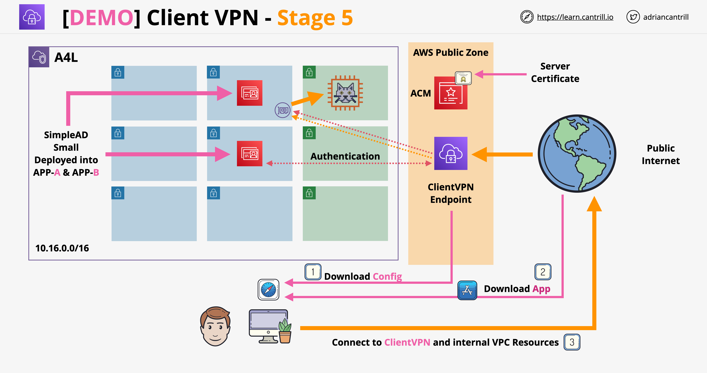

# AWS Client VPN

---
### Original Source
- https://github.com/acantril/learn-cantrill-io-labs/tree/master/aws-client-vpn

### Alternative VPN Server with OpenVPN and EC2
- [how-to-create-a-free-vpn-server-on-aws](https://towardsdatascience.com/how-to-create-a-free-vpn-server-on-aws-655ca3b3ff32)
---

In this demo, you will configure a client VPN deployment allowing workstations to connect to a AWS VPC in a safe and secure way

The demo consists of 6 stages, each implementing additional components of the architecture  

- Stage 1 - Create Directory Service (authentication for VPN users)
- Stage 2 - Certificates
- Stage 3 - Create VPN Endpoint
- Stage 4 - Configure VPN Endpoint & Associations
- Stage 5 - Download, install and test VPN Client
- Stage 6 - Cleanup

## 1-Click Installs (DO THIS FIRST)
Make sure you are logged into AWS and in `us-east-1`  

- [VPC](https://console.aws.amazon.com/cloudformation/home?region=us-east-1#/stacks/quickcreate?templateURL=https://learn-cantrill-labs.s3.amazonaws.com/aws-client-vpn/A4LVPC.yaml&stackName=A4L)

## Instructions

- [Stage1](02_LABINSTRUCTIONS/STAGE1.md)
- [Stage2](02_LABINSTRUCTIONS/STAGE2.md)
- [Stage3](02_LABINSTRUCTIONS/STAGE3.md)
- [Stage4](02_LABINSTRUCTIONS/STAGE4.md)
- [Stage5](02_LABINSTRUCTIONS/STAGE5.md)
- [Stage6](02_LABINSTRUCTIONS/STAGE6.md)

## Video Guides

- [Stage0](https://youtu.be/800wtu3zXz4)
- [Stage1](https://youtu.be/vYoE706c--8)
- [Stage2](https://youtu.be/IgvlqzIKzGQ)
- [Stage3](https://youtu.be/BjGt_kS9OgI)
- [Stage4](https://youtu.be/om90u3pr1kI)
- [Stage5](https://youtu.be/7CkuJwXZzl4)
- [Stage6](https://youtu.be/gBy2QNEdgkE)

## Architecture Diagrams

- [Stage1 - PNG](02_LABINSTRUCTIONS/STAGE1.png)
- [Stage1 - PDF](02_LABINSTRUCTIONS/STAGE1.pdf)
- [Stage2 - PNG](02_LABINSTRUCTIONS/STAGE2.png)
- [Stage2 - PDF](02_LABINSTRUCTIONS/STAGE2.pdf)
- [Stage3 - PNG](02_LABINSTRUCTIONS/STAGE3S.png)
- [Stage3 - PDF](02_LABINSTRUCTIONS/STAGE3.pdf)
- [Stage4 - PNG](02_LABINSTRUCTIONS/STAGE4.png)
- [Stage4 - PDF](02_LABINSTRUCTIONS/STAGE4.pdf)

